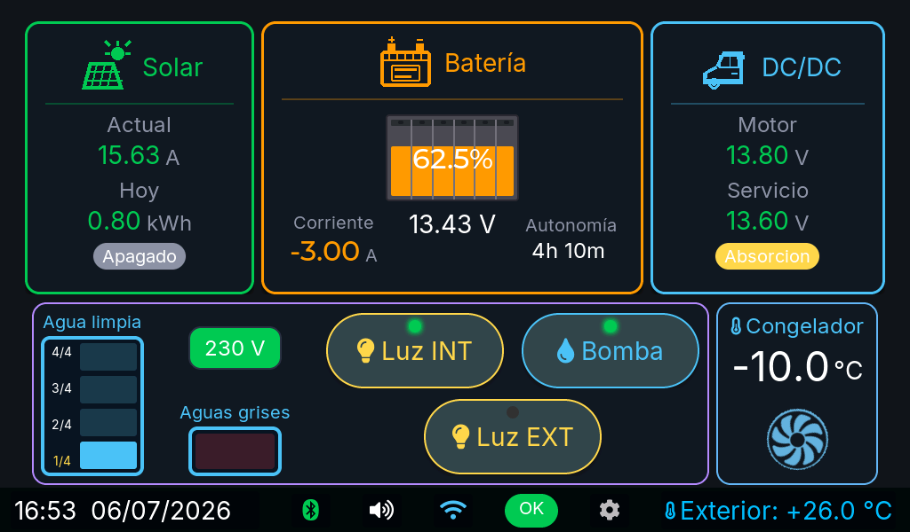
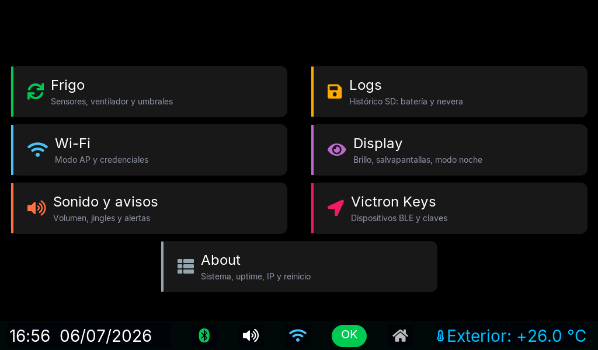
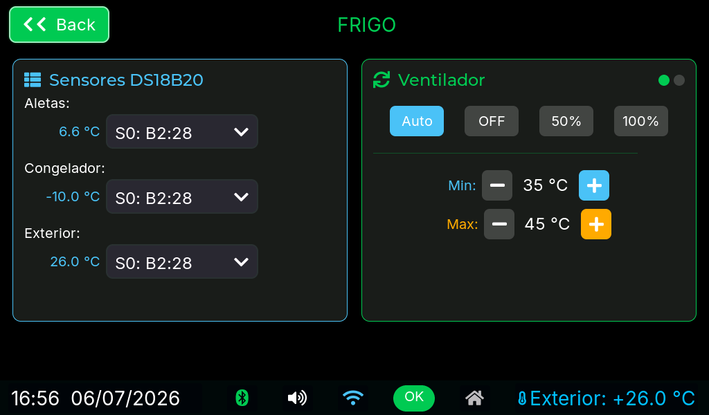

# Joint SPL 145 Control — VictronSolarDisplay port for Guition JC1060P470C_I (ESP32-P4)

**v1.0.0** · **[Español](#español) | [English](#english)**

---

## Capturas / Screenshots

<table>
  <tr>
    <td align="center"><br><sub>Vista general / Overview</sub></td>
    <td align="center"><br><sub>Ajustes / Settings</sub></td>
    <td align="center"><br><sub>Frigo / Fridge</sub></td>
  </tr>
</table>

---

## Español

Port del proyecto [victronsolardisplayesp (multi-device)](https://github.com/CamdenSutherland/victronsolardisplayesp/tree/multi-device) de CamdenSutherland, que a su vez es un fork de [VictronSolarDisplayEsp](https://github.com/wytr/VictronSolarDisplayEsp) de wytr.

Port realizado por **[Ehuntabi](https://github.com/Ehuntabi)**.

### Hardware

| Componente | Detalle |
|---|---|
| **Pantalla** | Guition JC1060P470C_I (7", 1024x600, DSI, touch GT911) |
| **SoC principal** | ESP32-P4 (RISC-V dual core 400 MHz, 32 MB PSRAM, 16 MB Flash) |
| **SoC WiFi/BT** | ESP32-C6 (SDIO vía esp_hosted: CLK=18, CMD=19, D0..D3=14..17) |
| **RTC** | RX8025T (I²C 0x32, SDA=7 / SCL=8 compartido con GT911 y ES8311) + pila CR1220 |
| **microSD** | SDMMC slot 0 IOMUX (CLK=43, CMD=44, D0..D3=39..42), LDO interno ch 4 (3.3 V) |
| **Sensores temperatura** | DS18B20 1-Wire en **GPIO 4** (JP1 pin 13, pullup 4.7 kΩ) |
| **Ventilador frigo** | PWM LEDC en **GPIO 5** (JP1 pin 15), 25 kHz |
| **Audio** | Codec ES8311 + amplificador NS4150 (PA_CTRL=11, I²S MCLK=13/BCLK=12/LRCK=10/DOUT=9) |
| **Medidor AC 220 V** | PZEM-004T v3 (UART2, TX=GPIO 32 / RX=GPIO 33 del JP1, Modbus 9600 8N1) |
| **Cámara** | OmniVision **OV02C10** (MIPI-CSI 2 lanes, RAW10 1928x1092, ~37 fps, JPEG por HW). Comparte el I²C (SDA=7 / SCL=8); sin pines reset/pwdn dedicados |
| **NE185 (autocaravana)** | RS-485 con el cuadro Nordelettronica NE185 vía MAX485 (U8), **UART1 TX=GPIO 26 / RX=GPIO 27**, 38400 8N1, conector J4 (DE/RE automático) |

> Pinout detallado con diagrama del JP1 (pines color-coded) y del CN2 en [`docs/pinout_guition_jc1060p470c_i.pdf`](docs/pinout_guition_jc1060p470c_i.pdf).

### Funcionalidades

#### UI estilo Venus OS
- Cards oscuras con borde de color por rol (cyan/verde/naranja/rojo/púrpura), métricas con número grande + unidad pequeña, pills de estado, gauges circulares para SOC y sombras suaves.
- **Iconos PNG propios** en headers de cards (batería de coche, panel solar, conversor DC/DC, casa) generados como `lv_img_dsc_t` embebidos en flash.
- Helpers reutilizables (`main/ui/ui_card.h`): `ui_card_create`, `ui_card_set_title_img`, `ui_metric_create_compact/_large`, `ui_pill_create`, `ui_arc_soc_create`, `ui_card_pulse`, paleta semántica `UI_COLOR_*`.
- **Pulso de actividad** en la card al recibir un BLE record (sombra anima 50→100→50 % en 600 ms, sin acumular animaciones).
- Pestañas Live/Settings ocultas — navegación con icono ⚙/🏠 discreto en la barra inferior + swipe horizontal del tabview. El botón Home **cierra la subpágina** y deja Settings en su menú principal.
- **Auto-vuelta a Live** tras 60 s sin actividad táctil.

#### Pantalla de bienvenida (splash)
- Logo de la furgo recortado con IA (rembg/u2net) y embebido a 720x400 RGB565 en flash.
- Animación de barra de progreso mientras dura la inicialización (BLE, audio, SD, BT).
- Configurable en Settings → Display: **Logo furgo** (default) o **Sin splash**.

#### Vistas Live
- **Overview** (default): fila horizontal Solar — Bat — Cargas con arc SOC central; debajo TTG + “PV X.X kWh · Cargas Y.Y kWh” acumulados del día.
- **Battery Monitor**: card naranja con arc SOC grande, V/A/W + pill enriquecido (“Cargando 5.5 A” / “Descargando 3.2 A”), barra bipolar de corriente ±50 A, sparkline de potencia (90 puntos), TTG / Consumido / Aux. Tap abre el histórico.
- **Solar Charger**: 2 cards (Solar verde + Salida batería naranja) con pill de estado (Bulk/Absorción/Float).
- **Default Battery**: 3 cards en fila (DC/DC cyan, Batería naranja con arc + sparkline + bar bipolar, Solar verde). En la card DC/DC el rótulo cambia entre `⚡ Alternador` (verde) o `🔋 Bat. motor` (gris) según la tensión.
- **Simple devices** (Inverter, Smart Lithium, AC Charger, etc.): card único con métricas apiladas; color e icono según tipo.
- **Pill rojo “FALLO: X”** en la card cuando un dispositivo Victron reporta `alarm_reason` (BMV/Inverter) o `charger_error` (Solar/DCDC/Orion).

#### Settings
Páginas con cards de borde de color, dropdown scrollable cuando hay overflow, separadores entre sub-bloques:
- **Frigo** (verde): control PWM del ventilador según T_Aletas.
- **Logs** (naranja): chart 24 h de batería y de temperaturas frigo. Swipe izquierda/derecha **navega por fecha** en los logs guardados en SD (header muestra la fecha seleccionada).
- **Wi-Fi** (azul): SSID, contraseña, switch on/off, modal “requiere reiniciar”.
- **Display** (cyan/púrpura/verde/naranja): card combinada **Brillo pantalla + Salvapantallas**; card **Modo nocturno** en una línea (switch + Inicio/Fin + brillo nocturno, brillo aplicado automáticamente entre las horas configuradas según RTC); **Pantalla de bienvenida** (logo furgo o sin splash).
- **Sonido y avisos** (rojo): volumen, switch silenciar avisos, umbrales SoC y temperatura del frigorífico.
- **Victron Keys** (rosa): MAC + clave AES por dispositivo (hasta 8), confirmación al modificar. Selector “Página inicial portal”: **Dashboard** (default), Logs o Keys.
- **About** (gris): uptime, RAM libre, IP del AP, chip, versión IDF, **Trip computer** con kWh/Ah cargados/consumidos y horas desde el último reset, **Backup configuración** (exportar/importar a `/sdcard/config_backup.json`), **Último reset** + contador de resets por watchdog/panic, botón Reboot con confirmación.

#### Barra inferior
- Reloj + fecha (RTC), iconos interactivos:
  - 🔵 BLE — gris si no hay datos en 5 s.
  - 🔊 / 🔇 Volumen — tap = mute/unmute.
  - 📶 Wi-Fi — tap = toggle AP on/off con modal.
  - **AC 142 W** — aparece solo si el PZEM-004T está conectado y mide tensión AC (verde en activo, gris en reposo, rojo en alarma).
  - ⚙ / 🏠 — navega entre Live y Settings.

#### BLE Victron
- Hasta 8 dispositivos por MAC + clave AES (NVS).
- Records soportados: 0x01 Solar Charger, 0x02 Battery Monitor, 0x03 Inverter, 0x04 DC/DC Converter, 0x05 Smart Lithium, 0x09 SBP, 0x0A Lynx Smart BMS, 0x0B Multi RS, 0x0C VE.Bus, 0x0D DC Energy Meter, 0x0F Orion XS.
- Detección automática del tipo y vista correspondiente.

#### PZEM-004T v3 (AC 220 V, opcional)
- Driver Modbus-RTU sobre UART2 (TX=GPIO 32, RX=GPIO 33 del JP1).
- Polling cada 2 s. Si el módulo no está conectado, el firmware sigue funcionando y muestra "no conectado" en el dashboard.
- Datos en `/api/state` JSON y card propia en el dashboard web.

#### Cámara y modo vigilancia (autocaravana)
- Sensor **OmniVision OV02C10** por MIPI-CSI (2 lanes, RAW10 1928x1092, ~37 fps), driver propio portado del kernel Linux; ISP en bypass y **JPEG por hardware** (ESP32-P4). Comparte el bus I²C (SDA=7/SCL=8) con touch/RTC; sin pines dedicados.
- Captura **a demanda** (1 frame cada ~2 s), no streaming continuo — así el DMA de la cámara no bloquea la SD. En uso normal sirve para **auto-brillo** (mide la luz ambiente).
- `GET /snapshot`: última imagen en JPEG (recortada 960x544, calidad 85, ~80-150 KB).
- **Modo ausente / vigilancia**: se activa desde *Settings → Sonido y avisos* o con `GET /ausente?on` (cuenta atrás de 10 s y apaga la pantalla). Detección de movimiento por rejilla de luminancia 32x18; al detectar guarda una foto JPEG en un **anillo de 8 en PSRAM** (no en SD, se pierde al reiniciar). Galería en `GET /vigilancia` (y `/vigilancia/<id>` para cada foto). Se sale con **4 toques en una esquina** o `GET /ausente?off`. *(Vídeo H.264: pendiente.)*
- **Cerrojo cámara↔SD** (`camera_sd_bus_lock`): cámara y SDMMC comparten GDMA; los escritores de SD (datalogger) serializan su E/S con este mutex para no provocar reinicios por INT_WDT.

#### NE185 — control de la autocaravana (RS-485)
- El P4 hace de **maestro RS-485** del cuadro de distribución **Nordelettronica NE185** (sustituye al panel NE187 retirado). MAX485 (U8) en **UART1** (TX=GPIO 26 / RX=GPIO 27, 38400 8N1), DE/RE automático por puerta NAND; conector J4 (A/B/GND/+5V).
- Polling cada 100 ms **alternando dos comandos "idle"** que imitan al NE187 (el NE185 solo devuelve datos si los ve alternados). Un botón = 8 tramas de pulsación (necesita ≥2) + 5 de reposo. Checksum + comprobación estructural; lectura robusta por barrido de fase (trama de 20 bytes y variante de 15 sin eco).
- Datos: **nivel de agua limpia** (0-4/4) y **grises** (lleno/vacío), luz interior/exterior, bomba, presencia de **230 V (shore)**, tensión de batería de **servicio** y de **motor**, y "fresco" (trama válida < 30 s).
- Controlable desde la UI (Overview) y por `POST /control`. Encendido automático de cargas al despertar (configurable, NVS).

#### Display satélite "mini" (UDP)
- Broadcast **UDP** (1 Hz) desde el AP del 7" a un segundo display **ESP32-C6 de 1,47"** (`192.168.4.255:4242`). Payload compacto (28 bytes, CRC32) con SoC/V/A de batería, DC/DC, frigo (temperatura + ventilador) y aguas del NE185. Protocolo compartido en `main/net/mini_proto.h` (debe ir **byte a byte idéntico** en ambos firmwares). Es "plan B" porque `esp_hosted` no exporta ESP-NOW.

#### Datalogger y persistencia
- **Frigo**: buffer circular RAM 200 entradas + CSV diario en `/sdcard/frigo/YYYY-MM-DD.csv`.
- **Batería**: 24 h en PSRAM (552 KB) con muestreo cada 10 s y `avg/max/min` por intervalo. CSV diario en `/sdcard/bateria/YYYY-MM-DD.csv` (5 columnas).
- **kWh acumulados del día** (`/main/energy_today.c`): integra V·I·Δt desde BMV; prefiere `yield_today_centikwh` del SmartSolar para PV. Reset automático a medianoche. Persistencia NVS cada 5 min.
- **Trip computer** (`/main/trip_computer.c`): contadores reseteables manualmente — kWh y Ah cargados/consumidos, horas activas. Persistencia NVS cada 5 min.
- Flush a SD periódico de frigo y batería; flush adicional antes de cualquier reset programado.
- Backup horario del epoch del sistema en NVS (`rtc_backup/epoch`).

#### RTC y hora
- Zona horaria Europe/Madrid por defecto (CET/CEST), aplicada desde NVS al arrancar y preservada en el backup de configuración.
- El RTC almacena hora local; `mktime` la interpreta con la TZ activa.

#### Salvapantallas
- Modos **Atenuar** o **Rotar vistas** (Live → LogFrigo → LogBateria cada N min).
- Periodo y brillo de reposo configurables en Settings → Display.

#### Watchdog + auto-recovery
- Hardware (IDF): TWDT 5 s + INT_WDT 300 ms, ambos con panic + reset al disparar.
- Software (`/main/watchdog.c`): task monitor adicional que comprueba salud de LVGL cada 3 s; si el lock falla 3 veces consecutivas hace flush a SD y reset controlado. Grace period de 30 s al boot.
- Contador de resets por TWDT/INT_WDT/panic en NVS, visible en Settings → About.

#### Portal web
- AP `VictronConfig` automático al arrancar.
- Nav consistente en todas las páginas: **Dashboard · Logs · Keys · Mirror**.
- `http://192.168.4.1/dashboard` (default): grid responsive con SoC, V/A/W, PV, DC/DC, energía hoy, trip computer y AC PZEM. Auto-refresh 2 s via `GET /api/state` (JSON).
- `http://192.168.4.1/mirror`: snapshot del display real cada 1.5 s (BMP 24-bit downsampleado 2x).
- `/data/frigo` y `/data/bateria`: gráficos SVG con auto-escala Y y downsample > 1500 puntos; polígono semitransparente max-min + línea avg.
- `/keys`: configuración de claves Victron.
- Sincronización automática de hora (`` GET → `/settime`, compatible captive portal).

#### Backup/restore de configuración
- Exporta brightness, view_mode, zona horaria, modo nocturno, screensaver, alerts, dispositivos Victron (MAC + AES + nombre) y flag debug a `/sdcard/config_backup.json` con cJSON.
- Importa desde el mismo fichero. La contraseña Wi-Fi **no** se exporta por seguridad.
- Botones Exportar/Importar en Settings → About.

### Compilación

Requisitos: ESP-IDF v5.4 o superior, target esp32p4.

```bash
git clone https://github.com/Ehuntabi/victron-jc1060p470c-esp32p4
cd victron-jc1060p470c-esp32p4
idf.py set-target esp32p4
idf.py build
idf.py -p /dev/ttyACM0 flash monitor
```

### Configuración inicial

1. Encender la pantalla — el AP Wi-Fi `VictronConfig` arranca automáticamente.
2. Conectarse al AP desde móvil o PC y abrir `http://192.168.4.1` — por defecto se carga el **Dashboard**.
3. Navegar a **Keys** (link superior) e introducir la MAC y clave AES de cada dispositivo Victron.
4. Volver al Dashboard para ver los datos en vivo.

### Estado del hardware

- **SD Card** ✅ — slot 0 IOMUX dedicado.
- **RTC RX8025T** ✅ — soporta pérdida de pila con backup en NVS.
- **DS18B20** — bus 1-Wire en GPIO 4 (JP1 pin 13). Pullup 4.7 kΩ a 3.3 V externo.
- **Ventilador** — PWM en GPIO 5 (JP1 pin 15).
- **PZEM-004T** — opcional, UART2 en GPIO 32/33 (JP1 pin 19/21). Si no está conectado, el firmware sigue funcionando sin él.

### Créditos

- Proyecto original: VictronSolarDisplayEsp por wytr.
- Fork multi-device: victronsolardisplayesp por CamdenSutherland.
- Port ESP32-P4 / Guition JC1060P470C_I + UI estilo Venus OS + extensiones: Ehuntabi.

---

## English

Port of [victronsolardisplayesp (multi-device)](https://github.com/CamdenSutherland/victronsolardisplayesp/tree/multi-device) by CamdenSutherland, itself a fork of [VictronSolarDisplayEsp](https://github.com/wytr/VictronSolarDisplayEsp) by wytr.

Ported by **[Ehuntabi](https://github.com/Ehuntabi)**.

### Hardware

| Component | Details |
|---|---|
| **Display** | Guition JC1060P470C_I (7", 1024x600, DSI, GT911 touch) |
| **Main SoC** | ESP32-P4 (RISC-V dual core 400 MHz, 32 MB PSRAM, 16 MB flash) |
| **WiFi/BT SoC** | ESP32-C6 (SDIO via esp_hosted: CLK=18, CMD=19, D0..D3=14..17) |
| **RTC** | RX8025T (I²C 0x32, SDA=7 / SCL=8 shared with GT911 and ES8311) + CR1220 cell |
| **microSD** | SDMMC slot 0 IOMUX (CLK=43, CMD=44, D0..D3=39..42), internal LDO ch 4 (3.3 V) |
| **Temp sensors** | DS18B20 1-Wire on **GPIO 4** (JP1 pin 13, 4.7 kΩ pull-up) |
| **Fridge fan** | LEDC PWM on **GPIO 5** (JP1 pin 15), 25 kHz |
| **Audio** | ES8311 codec + NS4150 amp (PA_CTRL=11, I²S MCLK=13/BCLK=12/LRCK=10/DOUT=9) |
| **AC 220 V meter** | PZEM-004T v3 (UART2, TX=GPIO 32 / RX=GPIO 33 of JP1, Modbus 9600 8N1) |
| **Camera** | OmniVision **OV02C10** (MIPI-CSI 2 lanes, RAW10 1928x1092, ~37 fps, HW JPEG). Shares I²C (SDA=7 / SCL=8); no dedicated reset/pwdn pins |
| **NE185 (camper)** | RS-485 to the Nordelettronica NE185 panel via MAX485 (U8), **UART1 TX=GPIO 26 / RX=GPIO 27**, 38400 8N1, J4 connector (automatic DE/RE) |

> Detailed pinout with colour-coded JP1 and CN2 diagrams in [`docs/pinout_guition_jc1060p470c_i.pdf`](docs/pinout_guition_jc1060p470c_i.pdf).

### Features

#### Venus-OS-style UI
- Dark cards with role-coloured borders (cyan/green/orange/red/purple), big-number metrics, status pills, circular SOC gauges, soft shadows.
- **Custom PNG icons** in headers (car battery, solar panel, DC/DC, house) embedded as `lv_img_dsc_t`.
- Reusable helpers in `main/ui/ui_card.h`: `ui_card_create`, `ui_card_set_title_img`, `ui_metric_create_compact/_large`, `ui_pill_create`, `ui_arc_soc_create`, `ui_card_pulse`, palette `UI_COLOR_*`.
- **Activity pulse** on card shadow when a BLE record arrives (600 ms ease-in-out, no anim stacking).
- Live/Settings tabs hidden — navigation via ⚙/🏠 icon in the bottom bar + horizontal swipe. The Home button **closes any sub-page** and leaves Settings on its main menu.
- **Auto-return to Live** after 60 s of touch inactivity.

#### Splash screen
- Camper photo cut out with AI (rembg/u2net) and embedded at 720x400 RGB565 in flash.
- Animated progress bar during init (BLE, audio, SD, BT).
- Configurable in Settings → Display: **Camper logo** (default) or **No splash**.

#### Live views
- **Overview** (default): horizontal row Solar — Battery — Loads with central SOC arc; below: TTG + “PV X.X kWh · Loads Y.Y kWh” today's totals.
- **Battery Monitor**: orange card with big SOC arc, V/A/W + enriched pill (“Charging 5.5 A” / “Discharging 3.2 A”), bipolar current bar ±50 A, power sparkline (90 points), TTG / Consumed / Aux. Tap opens history.
- **Solar Charger**: 2 cards (green Solar + orange Battery output) with charger state pill (Bulk/Absorption/Float).
- **Default Battery**: 3 cards (cyan DC/DC, orange Battery with arc + sparkline + bipolar bar, green Solar). DC/DC label switches between `⚡ Alternator` (green) and `🔋 Engine bat.` (grey) by voltage.
- **Simple devices** (Inverter, Smart Lithium, AC Charger, etc.): single card with stacked metrics.
- **Red “FAULT: X” pill** when a Victron device reports `alarm_reason` (BMV/Inverter) or `charger_error` (Solar/DCDC/Orion).

#### Settings
Pages with role-coloured cards, scrollbar visible on overflow, separators between sub-blocks:
- **Frigo** (green): PWM fan based on T_Fins.
- **Logs** (orange): 24 h battery + frigo temperature charts. Swipe left/right **navigates by date** across SD logs (header shows the active day).
- **Wi-Fi** (blue): SSID, password, on/off switch, restart modal.
- **Display** (cyan/purple/green/orange): combined **Brightness + Screensaver** card; single-line **Night mode** card (switch + start/end + night brightness, auto-applied within the time window by RTC); **Splash screen** (camper logo or none).
- **Sound & alerts** (red): volume, mute switch, SoC and freezer temperature thresholds.
- **Victron Keys** (pink): MAC + AES key per device (up to 8), confirmation modal on edit. “Web portal start page” selector: **Dashboard** (default), Logs or Keys.
- **About** (gray): uptime, free RAM, AP IP, chip, IDF version, **Trip computer** with kWh/Ah charged/discharged and active hours since last reset, **Configuration backup** (export/import to `/sdcard/config_backup.json`), **Last reset** + WDT/panic reset counter, Reboot button.

#### Bottom bar
- Clock + date (RTC), interactive icons:
  - 🔵 BLE — grey if no data for 5 s.
  - 🔊 / 🔇 Volume — tap to mute/unmute.
  - 📶 Wi-Fi — tap to toggle AP with restart modal.
  - **AC 142 W** — appears only if the PZEM-004T is connected and measuring AC voltage (green active, grey idle, red alarm).
  - ⚙ / 🏠 — navigate between Live and Settings.

#### Victron BLE
- Up to 8 devices by MAC + AES key (NVS).
- Records: 0x01 Solar Charger, 0x02 Battery Monitor, 0x03 Inverter, 0x04 DC/DC Converter, 0x05 Smart Lithium, 0x09 SBP, 0x0A Lynx Smart BMS, 0x0B Multi RS, 0x0C VE.Bus, 0x0D DC Energy Meter, 0x0F Orion XS.
- Automatic device-type detection and matching view.

#### PZEM-004T v3 (AC 220 V, optional)
- Modbus-RTU driver over UART2 (TX=GPIO 32, RX=GPIO 33 of JP1).
- 2 s polling. If the module is not connected, the firmware keeps running and shows "not connected" in the dashboard.
- Data exposed in `/api/state` JSON and a dedicated card in the web dashboard.

#### Camera & surveillance mode (camper)
- **OmniVision OV02C10** sensor over MIPI-CSI (2 lanes, RAW10 1928x1092, ~37 fps), custom driver ported from the Linux kernel; ISP bypassed and **hardware JPEG** (ESP32-P4). Shares the I²C bus (SDA=7/SCL=8) with touch/RTC; no dedicated pins.
- **On-demand** capture (1 frame every ~2 s), not continuous streaming — so the camera DMA doesn't block the SD. In normal use it drives **auto-brightness** (measures ambient light).
- `GET /snapshot`: latest image as JPEG (cropped 960x544, quality 85, ~80-150 KB).
- **Away / surveillance mode**: enabled from *Settings → Sound & alerts* or via `GET /ausente?on` (10 s countdown, then the screen turns off). Motion detection via a 32x18 luminance grid; on a hit it stores a JPEG in an **8-slot ring in PSRAM** (not on SD, lost on reboot). Gallery at `GET /vigilancia` (and `/vigilancia/<id>` per photo). Exit with **4 taps in one corner** or `GET /ausente?off`. *(H.264 video: pending.)*
- **Camera↔SD lock** (`camera_sd_bus_lock`): camera and SDMMC share GDMA; SD writers (datalogger) serialize their I/O with this mutex to avoid INT_WDT resets.

#### NE185 — camper control (RS-485)
- The P4 acts as **RS-485 master** of the **Nordelettronica NE185** distribution panel (replacing the removed NE187 panel). MAX485 (U8) on **UART1** (TX=GPIO 26 / RX=GPIO 27, 38400 8N1), automatic DE/RE via NAND gate; J4 connector (A/B/GND/+5V).
- Polling every 100 ms **alternating two "idle" commands** that mimic the NE187 (the NE185 only returns data when it sees them alternated). One button = 8 press frames (needs ≥2) + 5 idle frames. Checksum + structural check; robust reading via phase sweep (20-byte frame and a 15-byte echo-less variant).
- Data: **fresh water level** (0-4/4) and **grey water** (full/empty), interior/exterior light, pump, presence of **230 V (shore)**, **service** and **engine** battery voltage, and "fresh" (valid frame < 30 s).
- Controllable from the UI (Overview) and via `POST /control`. Automatic load switch-on on wake (configurable, NVS).

#### "Mini" satellite display (UDP)
- **UDP** broadcast (1 Hz) from the 7" AP to a second **1.47" ESP32-C6** display (`192.168.4.255:4242`). Compact payload (28 bytes, CRC32) with battery SoC/V/A, DC/DC, fridge (temperature + fan) and NE185 water levels. Shared protocol in `main/net/mini_proto.h` (must be **byte-for-byte identical** in both firmwares). It's "plan B" because `esp_hosted` doesn't export ESP-NOW.

#### Datalogger and persistence
- **Frigo**: 200-entry RAM ring + daily CSV at `/sdcard/frigo/YYYY-MM-DD.csv`.
- **Battery**: 24 h in PSRAM (552 KB) sampled every 10 s with avg/max/min per bin. Daily CSV at `/sdcard/bateria/YYYY-MM-DD.csv` (5 columns).
- **Today’s kWh accumulator** (`main/energy_today.c`): integrates V·I·Δt from BMV; prefers `yield_today_centikwh` from SmartSolar for PV. Auto-reset at midnight. NVS persistence every 5 min.
- **Trip computer** (`main/trip_computer.c`): user-resettable kWh and Ah charged/discharged + active hours. NVS persistence every 5 min.
- Periodic SD flush of frigo and battery logs; extra flush before any scheduled reset.
- Hourly NVS backup of the system epoch (`rtc_backup/epoch`).

#### RTC and time
- Europe/Madrid timezone by default (CET/CEST), applied from NVS at boot and preserved in the configuration backup.
- RTC stores local time; `mktime` interprets it with the active TZ.

#### Screensaver
- Modes **Dim** or **Rotate views** (cycle Live → FrigoLog → BatteryLog every N min).
- Period and idle brightness configurable in Settings → Display.

#### Watchdog + auto-recovery
- Hardware (IDF): TWDT 5 s + INT_WDT 300 ms, both panic + reset.
- Software (`main/watchdog.c`): monitor task that checks LVGL health every 3 s; if the lock fails 3 times in a row it flushes to SD and triggers a controlled reset. 30 s grace period at boot.
- TWDT/INT_WDT/panic reset counter in NVS, visible in Settings → About.

#### Web portal
- `VictronConfig` AP starts automatically on boot.
- Consistent navigation across pages: **Dashboard · Logs · Keys · Mirror**.
- `http://192.168.4.1/dashboard` (default): responsive grid with SoC, V/A/W, PV, DC/DC, today's energy, trip computer and AC PZEM. Auto-refresh every 2 s via `GET /api/state` (JSON).
- `http://192.168.4.1/mirror`: live display snapshot every 1.5 s (BMP 24-bit, 2× downsampled).
- `/data/frigo` and `/data/bateria`: SVG charts with Y-axis autoscale and downsample over 1500 points; semitransparent max-min envelope + average line.
- `/keys`: Victron key configuration page.
- Automatic time sync via `` GET → `/settime` (captive-portal compatible).

#### Configuration backup/restore
- Exports brightness, view_mode, timezone, night mode, screensaver, alerts, Victron devices (MAC + AES + name) and debug flag to `/sdcard/config_backup.json` via cJSON.
- Imports from the same file. The Wi-Fi password is **not** exported for safety.
- Export/Import buttons in Settings → About.

### Build

Requirements: ESP-IDF v5.4 or later, target esp32p4.

```bash
git clone https://github.com/Ehuntabi/victron-jc1060p470c-esp32p4
cd victron-jc1060p470c-esp32p4
idf.py set-target esp32p4
idf.py build
idf.py -p /dev/ttyACM0 flash monitor
```

### First-time setup

1. Power on the display — the `VictronConfig` Wi-Fi AP starts automatically.
2. Connect to the AP from your phone or PC and open `http://192.168.4.1` — the **Dashboard** loads by default.
3. Click **Keys** in the top nav and enter the MAC and AES key for each Victron device.
4. Back to Dashboard to see live data.

### Hardware status

- **SD card** ✅ — dedicated IOMUX slot 0.
- **RTC RX8025T** ✅ — survives battery loss with NVS backup.
- **DS18B20** — 1-Wire bus on GPIO 4 (JP1 pin 13). External 4.7 kΩ pull-up to 3.3 V.
- **Fan** — PWM on GPIO 5 (JP1 pin 15).
- **PZEM-004T** — optional, UART2 on GPIO 32/33 (JP1 pin 19/21). If not connected the firmware keeps running without it.

### Credits

- Original project: VictronSolarDisplayEsp by wytr.
- Multi-device fork: victronsolardisplayesp by CamdenSutherland.
- ESP32-P4 / Guition JC1060P470C_I port + Venus-OS-style UI + extensions: Ehuntabi.

This project keeps the same license as the original. See LICENSE.
