# Manual de la pantalla

**Autocaravana Joint SPL 145** · Pantalla de control de 7 pulgadas

---

## Qué es esto

Una pantalla táctil que te dice, de un vistazo, **cómo está la autocaravana**: la
batería, lo que produce la placa solar, la temperatura de la nevera, los depósitos
de agua y las luces.

No hace falta saber nada técnico para usarla. Se toca con el dedo, como un móvil.

---

## La barra de abajo

Está siempre, en todas las pantallas. De izquierda a derecha:

| | Qué significa |
|---|---|
| **Hora y fecha** | Si aparecen en blanco, la pantalla tiene la hora bien puesta |
| **Bluetooth** | En verde: está escuchando a los aparatos Victron |
| **Altavoz** | Toca aquí para el sonido y los avisos |
| **Wi-Fi** | Verde: la página web está lista. Azul: la red está encendida pero la web se ha dormido (se despierta sola al conectarte). Gris: el Wi-Fi está apagado. Toca aquí para encenderlo o apagarlo |
| **GPS** | Verde: hay posición. Naranja: está buscando satélites, dale un par de minutos. Gris: no llega nada del módulo. Este **no se toca**, solo informa |
| **Casa / engranaje** | Vuelve al inicio o entra en los ajustes |
| **Exterior** | La temperatura de fuera |

---

## La pantalla principal

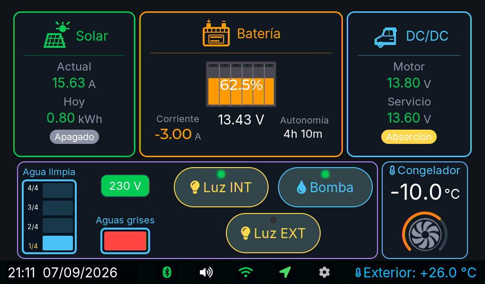

Es la que verás casi siempre. Cada recuadro es una cosa:

- **Solar** — lo que está entrando de la placa ahora mismo, y lo acumulado hoy.
- **Batería** — el porcentaje que queda, los voltios, y **cuánto te dura**
  ("Autonomía"). Si el número de corriente es negativo, estás gastando; si es
  positivo, estás cargando.
- **DC/DC** — el cargador que aprovecha el alternador cuando conduces.
- **Agua limpia** y **Aguas grises** — el nivel de los depósitos, por cuartos.
- **Luz INT / Luz EXT / Bomba** — tócalos para encender y apagar. El puntito verde
  quiere decir que está en marcha.
- **Congelador** — la temperatura dentro, y el ventilador de la nevera.

### Cambiar de vista

Hay un **selector de vista** para poner a pantalla completa el aparato que
quieras, con más detalle: batería, solar, monitor de batería, inversor y DC/DC.

Y **deslizando el dedo de lado** pasas de la vista en directo a los ajustes, y al
revés.

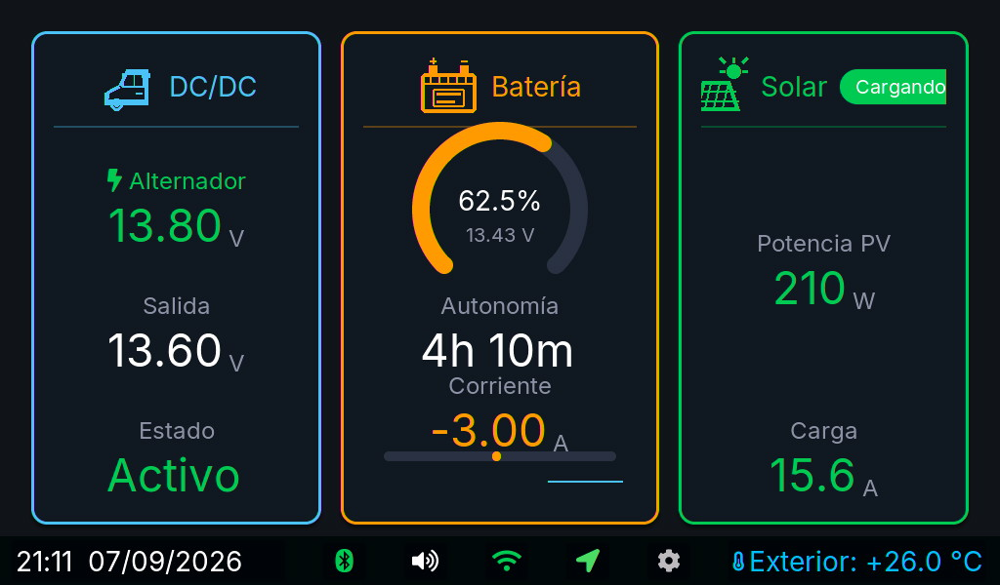
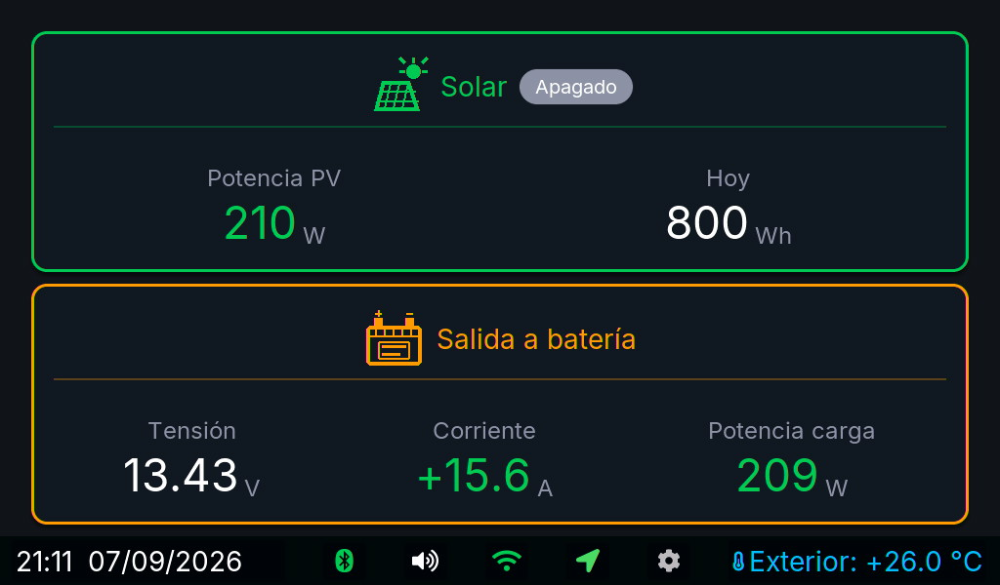

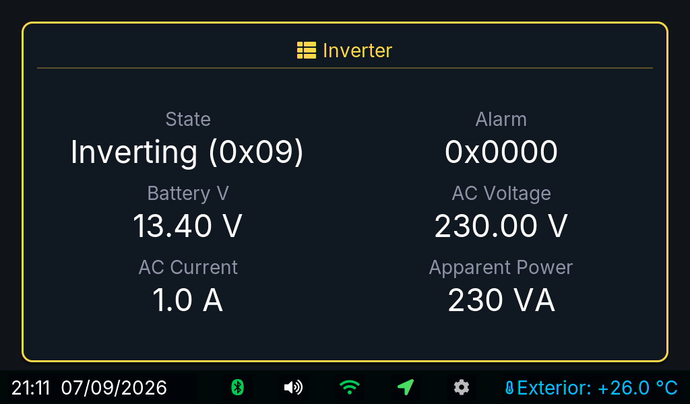
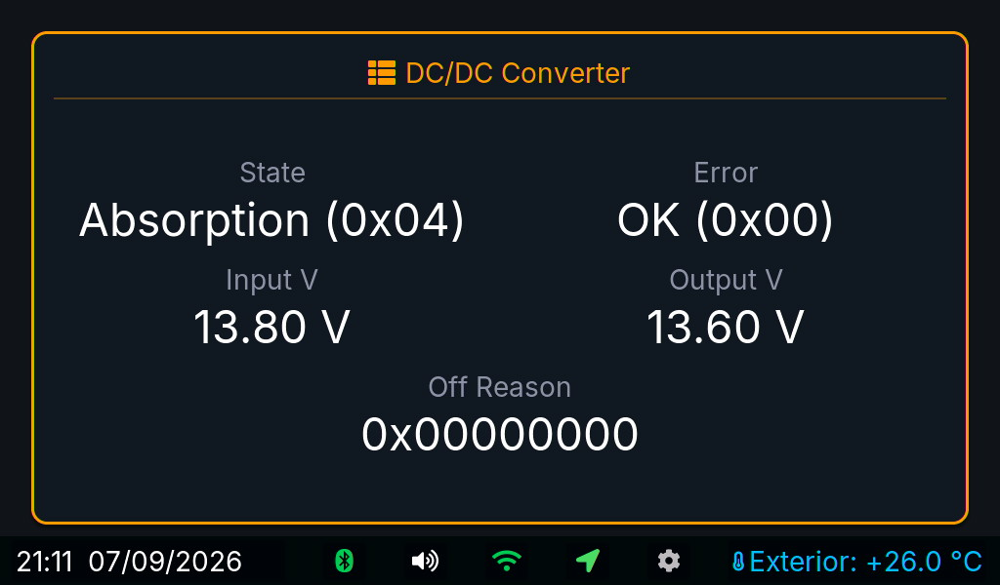

Y tocando una tarjeta de la principal entras en su ficha ampliada:

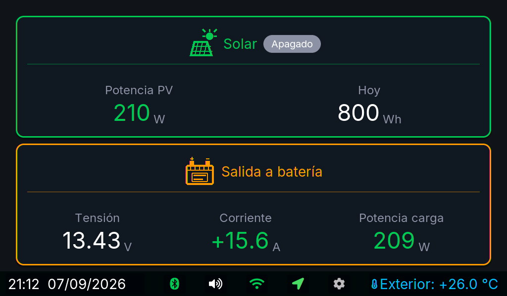
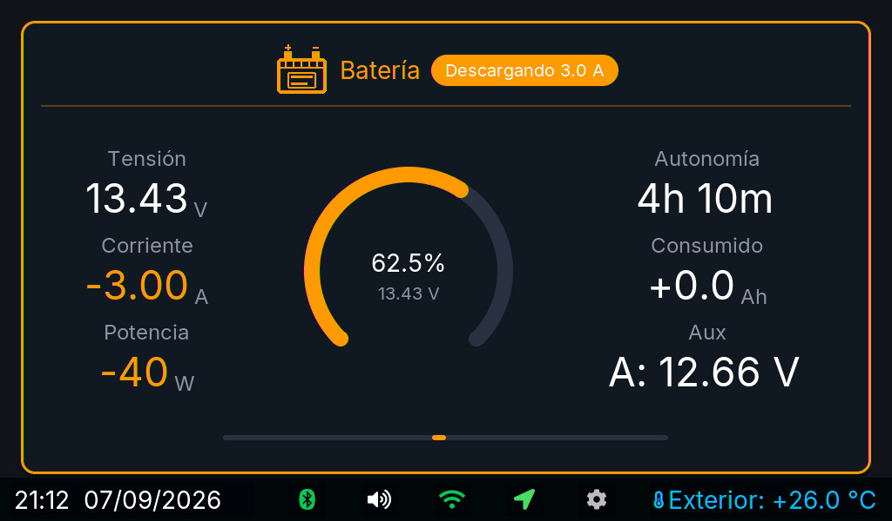

---

## Los gráficos: qué ha pasado hoy y estos días

La pantalla va **guardando todo** en su tarjeta de memoria. Eso te deja ver la
evolución, no solo el instante.

Se entra por **Ajustes → Historial en gráficos**.

### Batería

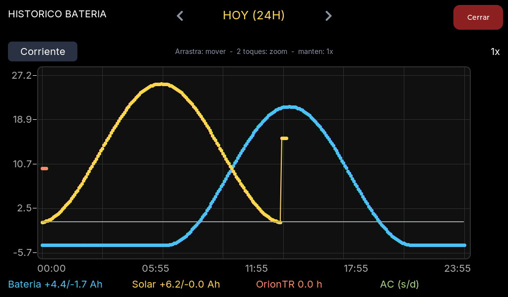

Cuánta corriente ha entrado y salido a lo largo del día, separando de dónde venía:
la placa, el alternador o el cargador de red. Abajo tienes el total de cada uno.

Se puede arrastrar para moverse y hacer pinza con dos dedos para acercar.

### Nevera

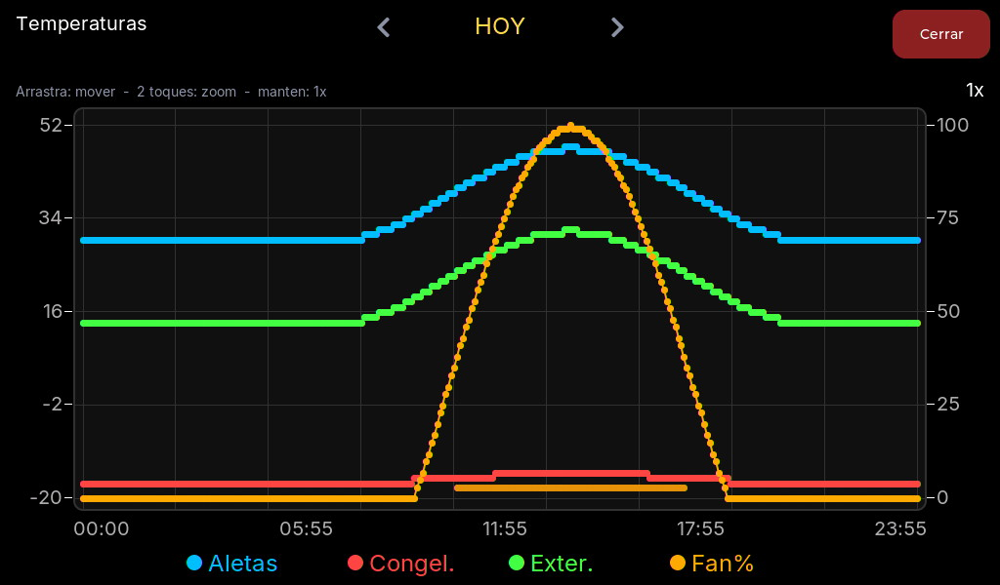

Las temperaturas del congelador y de las aletas, y cuánto ha estado funcionando el
ventilador. Útil para saber si la nevera está sufriendo con el calor.

### Solar, día a día

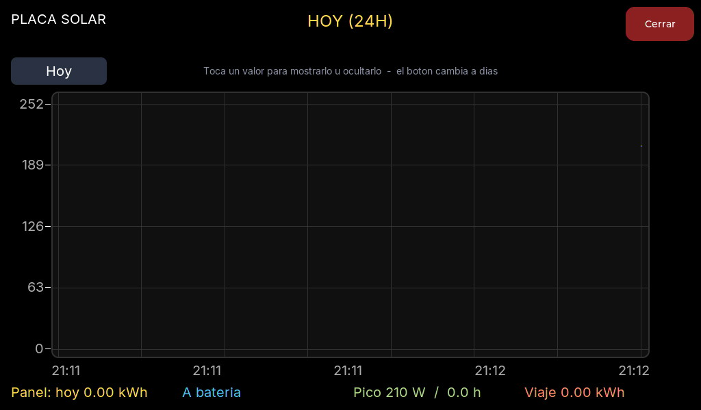

Cuántos kWh ha hecho la placa cada día. Aquí se ve rápido si un día estuvo nublado
o si has aparcado a la sombra.

---

## Ajustes

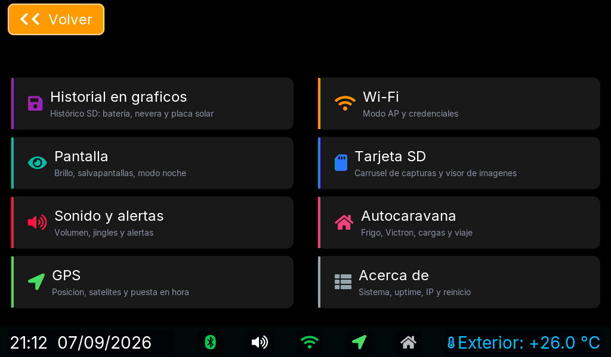

Ocho apartados. Vamos uno a uno.

### GPS

Dice dónde estás y, sobre todo, **pone la pantalla en hora sola**. Arriba, el
estado con su color y cuántos satélites ve; debajo, la posición y la hora que da
el GPS, que es exacta.

Los tres estados son los mismos que el icono de abajo, y cada uno te dice qué
hacer:

| | Qué pasa | Qué hacer |
|---|---|---|
| 🟢 **Posición fijada** | Todo bien | Nada |
| 🟠 **Buscando satélites** | El módulo funciona, aún sin posición | Esperar uno o dos minutos. Bajo techo puede no llegar a fijar |
| 🔴 **Sin señal del módulo** | No llega nada por el cable | Revisar la conexión. Esperar no sirve de nada |

Abajo salen las **tramas en crudo**: lo que manda el módulo tal cual. No hay que
entenderlas — sirven para distinguir de un vistazo si el problema es el cable
(no aparece nada), la conexión (salen ilegibles) o simplemente que aún está
buscando (salen bien pero sin datos).

> **La hora se pone sola.** Con posición fijada, la pantalla ajusta su reloj con
> el del GPS y lo repasa cada seis horas. Eso también arregla la hora de la
> pantalla pequeña de la cabina, que no tiene reloj propio y coge la de aquí.

### Wi-Fi

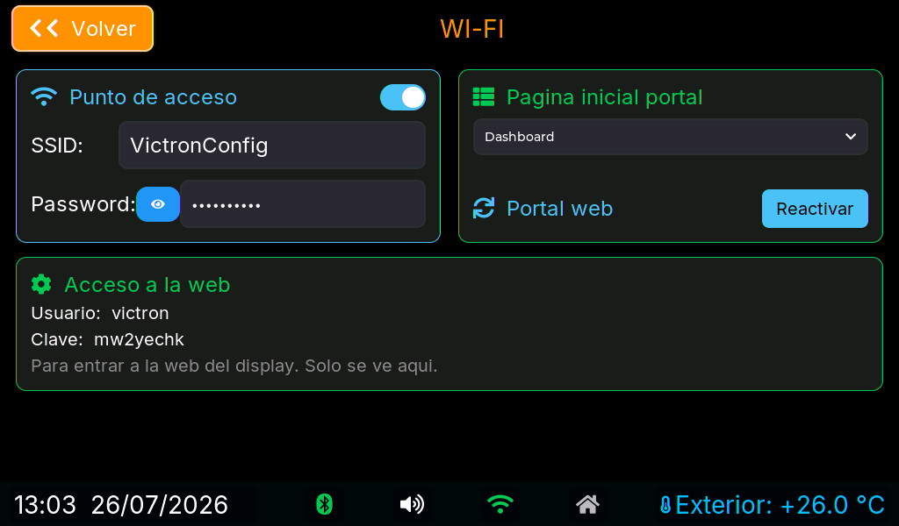

La pantalla **crea su propia red**, no se conecta a la tuya. Te conectas a ella con
el móvil para bajarte datos o actualizarla.

> **Importante:** aquí es donde ves la **contraseña** de esa red. Pulsa el botón
> del ojo para leerla. Cada pantalla tiene la suya, distinta, generada por ella
> misma — no hay una contraseña "de fábrica" que valga para todas.

Con esa contraseña ya tienes acceso: una vez tu móvil está en su red, las páginas
se abren directamente y la app funciona sin configurar nada.

Hay **dos excepciones**, que piden además el usuario y la contraseña que verás
debajo, en la tarjeta *Acceso a Actualizar y Claves*:

- **Actualizar la pantalla** (`/ota`), porque reescribe su programa interno.
- **Claves Victron** (`/keys`), porque enseña las claves de tus aparatos.

Son las dos cosas con las que alguien podría hacer daño de verdad. Así, si alguna
vez le das el Wi-Fi a un invitado, puede mirar los datos pero no tocar eso. El
navegador te las pedirá una sola vez y las recordará.

El **interruptor** de arriba enciende y apaga la red, y el cambio es inmediato:
no hay que reiniciar nada.

> **Ojo:** con el Wi-Fi apagado, el **display pequeño se queda sin datos** — los
> recibe justamente por esa red. Si el mini se queda en blanco, lo primero que
> hay que mirar es si el Wi-Fi está encendido.

### Pantalla

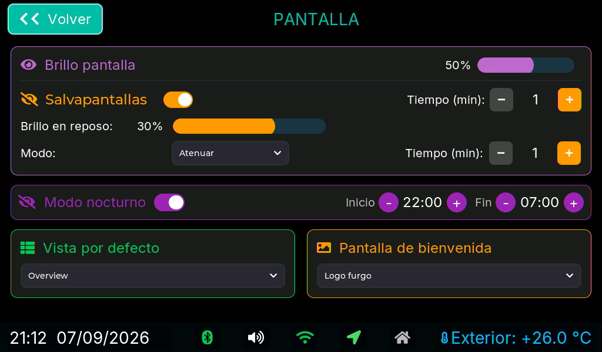

Brillo, salvapantallas y modo noche (baja el brillo solo a partir de cierta hora).

### Tarjeta SD

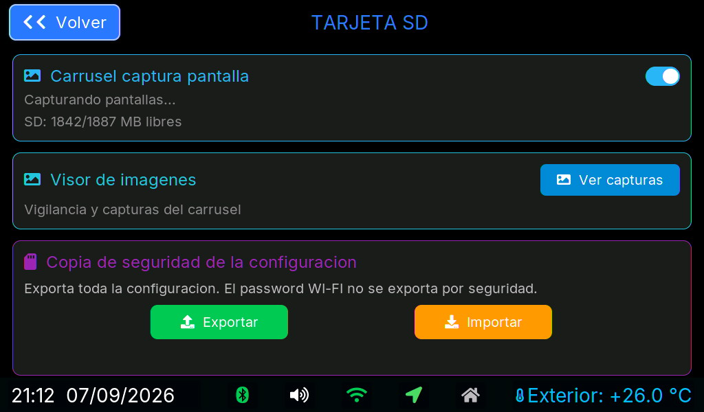

- **Carrusel de capturas** — hace una foto de cada pantalla y las guarda. Sirve
  para documentar o para enseñar cómo está configurada.
- **Visor de imágenes** — para ver esas capturas y las fotos de vigilancia sin
  sacar la tarjeta.
- **Copia de seguridad** — exporta toda la configuración a la tarjeta. La
  contraseña del Wi-Fi **no** se exporta, a propósito.

### Sonido y alertas

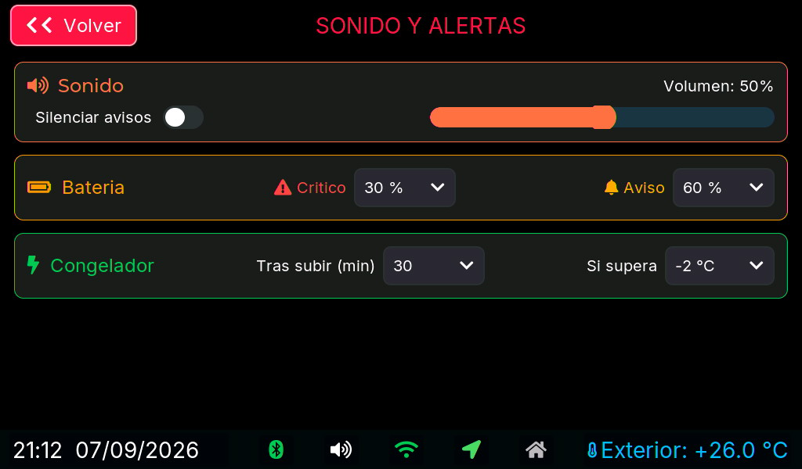

Volumen, avisos sonoros y a partir de qué valores quieres que te avise (por
ejemplo, batería baja o congelador demasiado caliente).

### Autocaravana

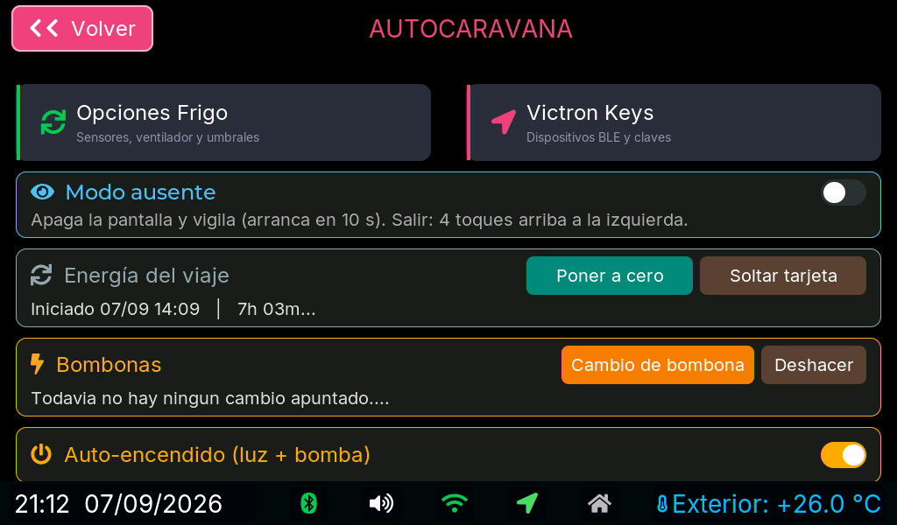

El apartado con más chicha:

- **Opciones Frigo** — ver más abajo.
- **Victron Keys** — dar de alta los aparatos Victron.
- **Modo ausente** — apaga la pantalla y **vigila por movimiento**. Se activa a los
  10 segundos. Para salir: **cuatro toques en la esquina superior izquierda**.
- **Trip computer** — el contador del viaje. **Inicio** lo pone a cero y
  **Finalizar** lo cierra. Te dice cuánto has cargado y cuánto has gastado.
- **Auto-encendido (luz + bomba)** — enciende luz y bomba solo al arrancar.

### Opciones Frigo

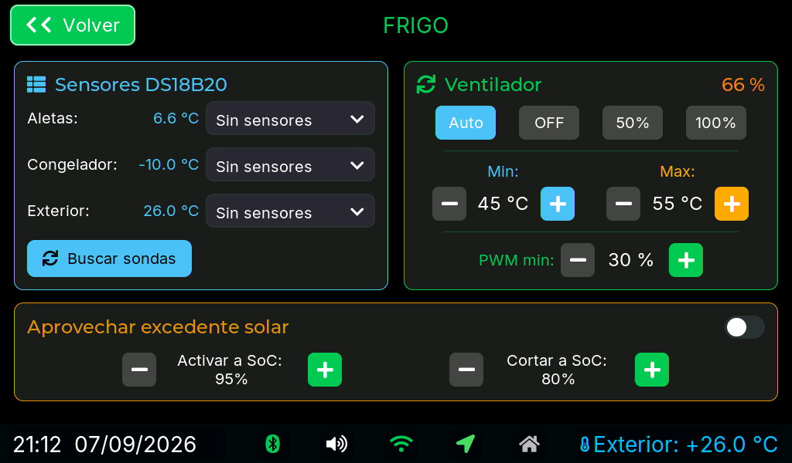

Aquí se ajusta el ventilador que refrigera la nevera:

- **Qué sonda es cuál** — cada sonda de temperatura se asigna a su sitio: aletas,
  congelador o exterior.
- **Buscar sondas** — si cambias o arreglas una sonda con la pantalla encendida,
  este botón la encuentra sin reiniciar. Si el conjunto cambia, sale un aviso para
  que compruebes que cada una sigue en su sitio.
- **Mín / Máx** — entre qué temperaturas quieres que el ventilador vaya subiendo.
- **Modo** — automático, apagado, 50 % o 100 %.
- **Excedente solar** — aprovecha la placa cuando sobra sol y la batería está alta.

### Victron Keys

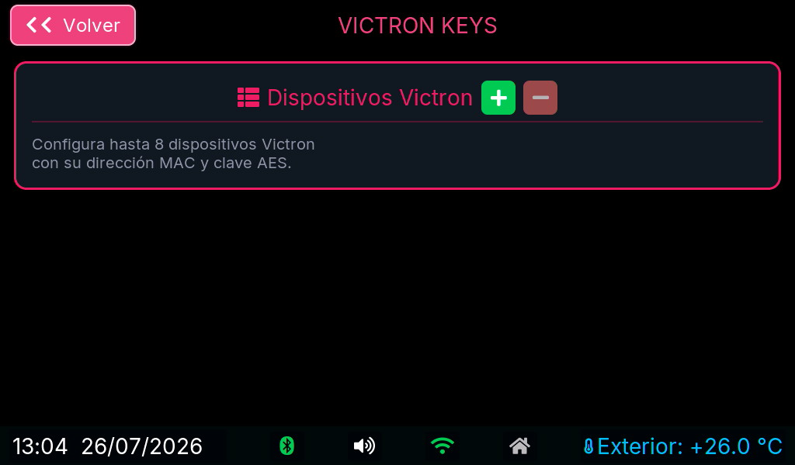

Los aparatos Victron (regulador solar, monitor de batería, cargador…) emiten sus
datos por Bluetooth **cifrados**. Para leerlos hay que darlos de alta con su
dirección y su clave, que se sacan de la app oficial de Victron.

### Acerca de

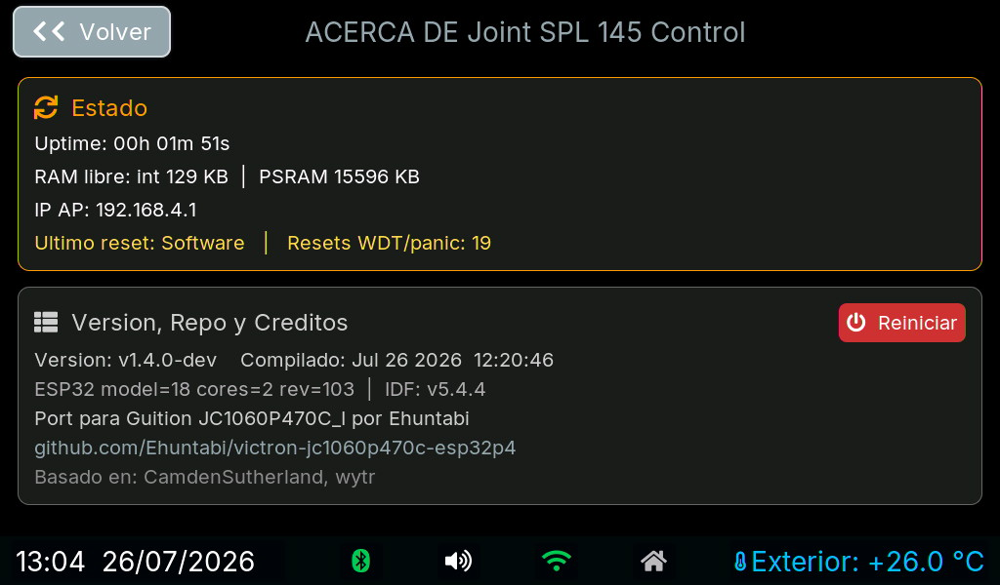

Versión que lleva, cuánto tiempo lleva encendida, su dirección en la red, y el
botón de reiniciar.

---

## La galería

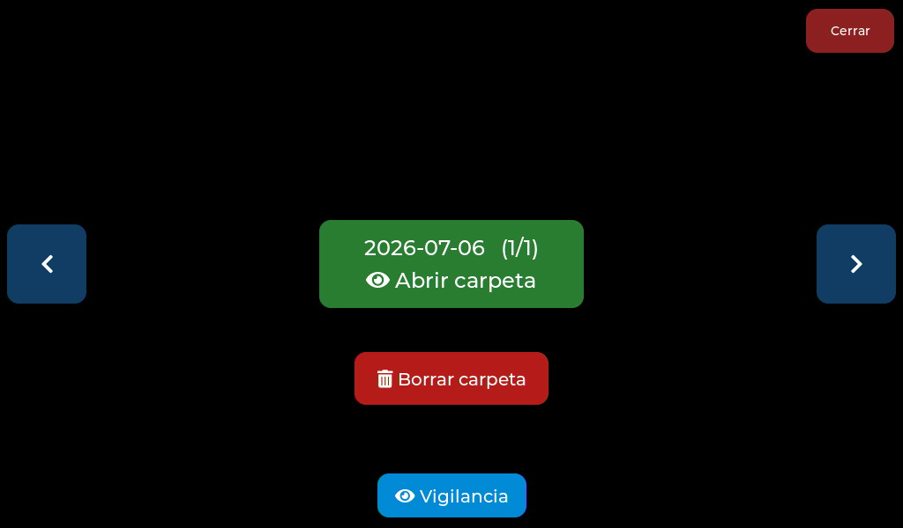

Enseña a pantalla completa las capturas y las fotos que ha ido tomando la cámara de
vigilancia, sin tener que sacar la tarjeta.

---

## Cómo se hacen las cosas

### Bajarme los datos de un viaje

1. En el móvil, conéctate al **Wi-Fi de la pantalla** (la contraseña, en
   Ajustes → Wi-Fi).
2. Abre el navegador en `http://192.168.4.1/data`.
3. Pulsa **viaje**. Se descarga un único fichero con la batería, el solar y la
   nevera.
4. En casa, ese fichero se importa en el analizador del ordenador y te genera el
   informe del viaje.

### Actualizar la pantalla sin cables

1. Conéctate a su Wi-Fi.
2. Abre `http://192.168.4.1/ota`.
3. Te pedirá un **usuario y una contraseña**: son los de la tarjeta *Acceso a
   Actualizar y Claves*, en **Ajustes → Wi-Fi**. Solo la primera vez; el
   navegador las recuerda.
4. Sube el fichero de la versión nueva y espera. La pantalla se queda fija
   con un aviso de "Actualizando firmware" (no se puede tocar nada mientras
   dura, es normal) y se reinicia sola en unos 20 segundos.

Si algo saliera mal a medias, **vuelve sola a la versión anterior**. No te quedas
sin pantalla.

### Cambiar la contraseña del Wi-Fi

En **Ajustes → Wi-Fi**, escribe la que quieras y sal del recuadro para que se
guarde. La nueva clave **no entra hasta que se reinicia la red**: apaga y vuelve
a encender el interruptor de esa misma página y ya está.

Después, el móvil y el ordenador tendrán que volver a conectarse con la nueva.

### Empezar un viaje nuevo

Al encenderla te pregunta si quieres empezar viaje. También puedes hacerlo cuando
quieras en **Ajustes → Autocaravana → Trip computer → Inicio**.

---

## Si algo no va

| Lo que ves | Qué suele ser |
|---|---|
| Temperaturas con guiones `--` | La sonda no responde. Mira el cable y usa **Buscar sondas** |
| Un aparato Victron no aparece | Su clave no está dada de alta, o está fuera de alcance |
| No encuentro su red Wi-Fi | Mira el icono Wi-Fi de la barra: si está gris, está apagada — tócalo para encenderla. La red **no** se apaga sola |
| Entré en el Wi-Fi pero no abre la página | Es normal si llevaba rato sin nadie: la web se duerme a los 15 minutos y **se despierta sola** al conectarte. Espera unos segundos y recarga. Comprueba también que escribes `http://192.168.4.1` (no `https`) |
| El display pequeño se quedó sin datos | Comprueba que el Wi-Fi de la pantalla grande está encendido: el mini recibe los datos por esa red |
| Me pide usuario y contraseña al actualizar o al abrir Claves | Es a propósito: son las dos páginas protegidas. Los datos están en **Ajustes → Wi-Fi**, tarjeta *Acceso a Actualizar y Claves* |
| La pantalla está negra y no responde | Puede estar en **modo ausente**: cuatro toques en la esquina superior izquierda |
| Se reinició sola | **No es normal, no se reinicia sola a propósito.** Mira en **Ajustes → Acerca de**: ahí pone el motivo del último reinicio y cuántos lleva |

---

Las imágenes de este manual se generan con el carrusel de capturas de la
propia pantalla, con datos de ejemplo.
